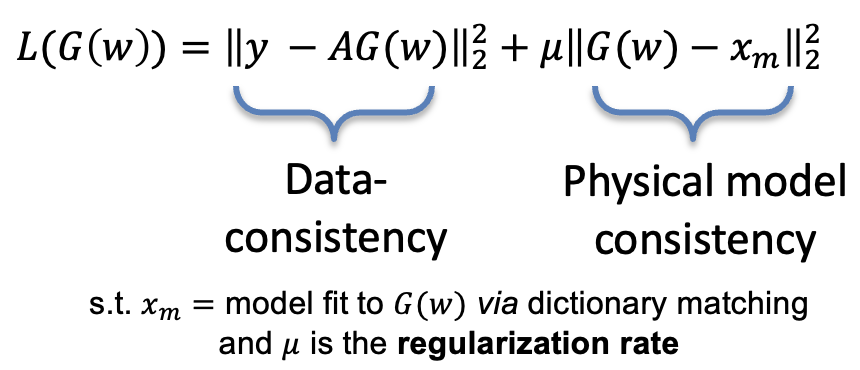

# ConvDecoder with Physics based regularization, implemented using DeepInPy.
DeepInPy is a package for training deep inverse problems in Python by Jonathan I. Tamir, located at https://github.com/utcsilab/deepinpy.git. The code in this repository is adapted from the original DeepInPy framework with slight modifications for the purpose of this project. 

It is highly encouraged to review the [getting_started.md](https://github.com/utcsilab/deepinpy/blob/master/docs/getting_started.md) document for DeepInPy, which explains data formatting and how to set up configurations. 

The manuscript associated with this work can be at arxiv:xxxx and has been submitted to Magnetic Resonance in Medicine for review. 


## Purpose:
The purpose of this project is to apply physics-based regulization in training a modified ConvDecoder architecture (G(w))[Darestani et al. 2021. arXiv:2007.02471v3] for accelerated dynamic MRI. 

The proposed regularization term provides an early stopping condition that does not require access to ground truth data. This allows for automated early stoping that yields reconstructed images and corresponding quantitative parameter maps at a high resolution. The cost function for this training is defined in the following figure.



## Installation

```
conda install -c pytorch pytorch 
pip install -r requirements.txt
```


### Test dataset
https://utexas.box.com/s/ynm4g740x3rrtiuzdsqma9bweqmonk6v

There are 8 available datasets in .h5 format: 4 raw k-space datasets and 4 simulated datasets from synthesizing the forward model and thus eliminating model error. There are four acceleration factors, R, available for testing: R = 8, 12, 18, 36. 

Simulated dataset file names are formatted as follows: dataset_VFA_Sub8_brain_FA4_20_norm1000_noise_simData_bartMask_acc['R'].h5
Raw dataset file names are formatted as follows:       dataset_VFA_Sub8_brain_FA4_20_norm1000_noisewhitened_rawData_bartMask_acc['R'].h5

The user may replace 'R' with any one of the four acceleration factors available.

## Run an example reconstruction


Here we will reconstruct images from the raw data of a representative subject, whose fully-sampled raw data has been retrospectively accelerated by a factor R. All config files for this subject can be found under /configs and can be edited accordingly to ensure the correct file paths to the dictionary and dataset are used on the user's local machine. The data in h5py format is available for download at the link above under "Test dataset". This code is adapted to run on a GPU.

To run CD+r on reconstructing the raw dataset retrospectively accelerated by a factor of R = 36, one can run the following command in terminal:

```bash
python main.py --config Sub8_configs/Sub8_brain_VFA_raw_T1reg_sup_R36.json
```

For running ConvDecoder without regularization, the following modification is made to select the appropriate config file:
```bash
python main.py --config Sub8_configs/Sub8_brain_VFA_raw_T1reg_sup_R36.json
```

## Visualizing reconstruction outputs

Tensorboard is the ideal way to view the training progress of the experiments in a browser window. Log files are saved under `cdr_mri/logs`
and can then be opened using the following command:
```
tensorboard --logdir logs/[log file name] --port [port number]
```

